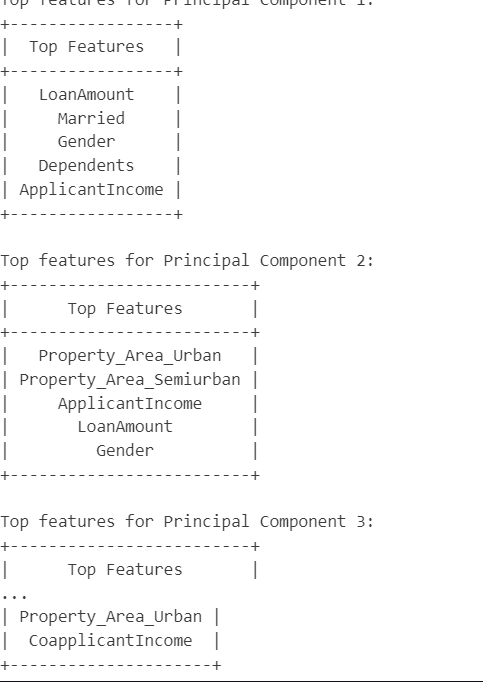

# 2024_ia651_Bekobo_Ahsan
Code for 2024_ia651_Bekobo_Ahsan
#  Predictive Modeling of Loan Approval Status: A Machine Learning Approach

 
- [Project overview](#project-overview)
- [Dataset](#dataset)
  * [**Fields in the Dataset:**](#--fields-in-the-dataset---)
- [Objectives and Background](#objectives-and-background)
- [Data Exploration](#data-exploration)
  * [Data Visualization](#data-visualization)
  * [Data Cleaning](#data-cleaning)
  * [Data Preprocessing](#data-preprocessing)
  * [Correlation Analysis](#correlation-analysis)
- [Model Selection and evaluation metrics](#model-selection-and-evaluation-metrics)
  * [Evaluation Metrics:](#evaluation-metrics-)
- [Model Training](#model-training)
  * [Decision Tree Classifier:](#decision-tree-classifier-)
  * [Pipeline Construction and Hyperparameter Tuning for LR, SVC, RF:](#pipeline-construction-and-hyperparameter-tuning-for-lr--svc--rf-)
- [Results and Metrics](#results-and-metrics)
- [SMOTE Process](#smote-process)
  * [Pipeline Construction and Hyperparameter Tuning for LR, SVC, RF:](#pipeline-construction-and-hyperparameter-tuning-for-lr--svc--rf--1)
  * [Results and Metrics Summary:](#results-and-metrics-summary-)
- [Feature Importance](#feature-importance)
- [Testing with new data](#testing-with-new-data)
  * [Dataset](#dataset-1)
- [Production Guidelines](#production-guidelines)
- [Conclusion and Recommendations](#conclusion-and-recommendations)
  * [Findings:](#findings-)
  * [Recommendations:](#recommendations-)

# Project overview

The Loan Approval Prediction project aims to analyze a dataset containing information about loan applicants and their respective loan approval outcomes. The dataset provides valuable insights into various factors that influence the decision-making process of loan approvals. By leveraging data exploration, statistical analysis, and predictive modeling techniques, this project seeks to understand the patterns and relationships within the data to develop a predictive model for loan approval status.

# Dataset
The dataset used in this project is sourced from Kaggle, "LoanApprovalPrediction.csv". It contains information about loan applicants, including demographic data (gender, marital status), financial details (income, loan amount), and credit history. The dataset consists of 598 entries and 13 columns after removing duplicates.

## **Fields in the Dataset:**

* *Loan_ID*: Unique identifier for each loan application

* *Gender*: Gender of the applicant👨👩

* *Married*: Marital status of the applicant (Yes/No)👰💍

* *Dependents*: Number of dependents of the applicant👨‍👩‍👧‍👦

* *Education*: Applicant's education level (Graduate/Not Graduate)

* *Self_Employed*: Whether the applicant is self-employed (Yes/No)

* *ApplicantIncome*: Income of the applicant

* *CoapplicantIncome*: Income of the co-applicant

* *LoanAmount*: Loan amount applied for

* *Loan_Amount_Term*: Term of the loan in months

* *Credit_History*: Credit history score

* *Property_Area*: Area where the property to be purchased is located (Urban/Semiurban/Rural)

Target varaiable is *Loan_Status*: Loan approval status (Y = Yes, N = No)

# Objectives and Background

Loans are vital for economic health and growth. They:

* Stimulate Economic Growth: Provide capital for business investments and consumer purchases.
* Support Business Development: Fund startups, expansions, and working capital.
* Create Jobs: Contribute to employment opportunities and skill development.
* Enable Home Ownership: Boost the real estate market and help individuals build wealth.
* Fund Infrastructure: Support public projects like roads and bridges.
* Enhance Financial Stability: Offer access to credit and manage financial fluctuations.
* Promote Innovation: Finance research and development efforts.
* Increase Efficiency: Allocate resources effectively to high-potential projects.

At the individual level, Loans seems crucial in America. From Homwownership, Education, Car, Personal Development, loan enable individuals to pursue their dreams and achieve financial stability. A loan however is not always guaranteed despite meeting minimum requirement. Loans approval requirements can be complex.

The goal of this project is to predict whether a loan application will be approved (Loan_Status) based on various applicant features. This prediction is crucial for financial institutions to automate and streamline the loan approval process, ensuring efficient use of resources and improving customer satisfaction. Also it will ensure compliance, avoid fraud  and promotes Transparency

# Data Exploration
## Data Visualization
Histograms and Boxplots: Histograms and boxplots were used to visualize the distribution and spread of numerical features such as ApplicantIncome, CoapplicantIncome, and LoanAmount. 

Countplots: Countplots were employed to explore the distribution of categorical features like *Gender, Married, Education, Self_Employed, Property_Area, and Credit_History* with respect to loan approval status (*Loan_Status*). These plots revealed insights into the distribution of applicants across different categories and their respective loan approval rates.
Scatterplots to observe x y relationships between quantitatives variables.

## Data Cleaning
we dropped duplicates and handles missing values. Outliers were not removed as Missing values were handled as follows:

*Loan_Amount_Term*: Imputed 14 missing variables with the mode (most frequent term).

*LoanAmount*: Imputed 21 variables with the median to prevent skewed variables.

*Dependents*: Imputed 12 missing dependent variables and Credit_History: 49 credit history missing with the mode of each category.

After imputation, the dataset was verified to have no missing values (loan.isna().sum()).

## Data Preprocessing
**-Distribution of Features**

**Numerical Features:**

* ApplicantIncome and CoapplicantIncome exhibit high skewness.
* LoanAmount and Dependents also show noticeable skewness, requiring potential transformations for modeling.

**-Categorical Features:**

Showed imbalances in all categories more males than females, more graduates than non-graduates) but it reflects the actual world

Class Distribution of Loan_Status: The dataset shows a class imbalance towards loan approvals (Y), which will be addressed during model training using Smote.

## Correlation Analysis
Correlation Matrix: Visualized to identify relationships between numerical variables.
Positive correlations observed between income levels and loan amounts.

Principal Component Analysis (PCA): Used to identify key features contributing to variance.

Top features for each principal component were identified, showing which variables have the most influence.

# Model Selection and evaluation metrics
X and Y Variables:

**X Variables:** Gender, Married, Education, Self_Employed, Property_Area, Credit_History, Loan_Amount_Term, ApplicantIncome, CoapplicantIncome, LoanAmount, Dependents

**Y Variable:** Loan_Status (Binary classification: Y/N)

The dataset was split into training (80%) and test (20%) sets using stratified sampling to maintain class distribution.

Four  different models were selected: Decision Tree Logistic Regression, SVC with radial basis function kernel, and Random Forest Classifier.

Starting with a Decision Tree model not only provides a foundational understanding of the data but also assists in visualizing and interpreting the decision boundaries. it also gives a baseline to compare other models and the importance of hyperparameters on evaluation metrics

Each of the other three model was trained using a pipeline that included standard scaling of features and hyperparameter tuning using GridSearchCV with different cross-validation strategies (StratifiedKFold and KFold with 5 folds).

## Evaluation Metrics:
To evaluate our model we used: *Accuracy,F1-score, Recall, Precison, Confusion Matrix, and Receiver Operating Characteristic (ROC) curve* were plotted to evaluate the trade-off between True Positive Rate (Sensitivity) and False Positive Rate (1 - Specificity).

# Model Training
## Decision Tree Classifier:
Starting with a Decision Tree model not only provides a foundational understanding of the data but also assists in visualizing and interpreting the decision boundaries of the loan datset. it also gives a baseline to compare other models and the importance of hyperparameters on evaluation metrics

* **Model Training:** Utilized DecisionTreeClassifier with varying depths (1 to 20) to find optimal max_depth.
* **Performance Metrics:** Evaluated models based on training and test accuracy, as well as F1 scores.
* **Validation:** Identified the best model based on maximum test accuracy achieved.
We visualize decision tree at the best depth.

*Figure: Decision Tree with Hyperparameters and cross-validation* 

## Pipeline Construction and Hyperparameter Tuning for LR, SVC, RF:

The introduction of streamlined pipelines for *Logistic Regression (LR), Support Vector Classification (SVC), and the Random Forest(RF) Classifier* proved to be monumental in refining the preprocessing and model fitting processes.
To evaluate our model we used: Accuracy,F1-score, Recall, Precison, Confusion Matrix, ROC Curve, Receiver Operating Characteristic (ROC) curve and Area Under the Curve (AUC) were plotted to evaluate the trade-off between True Positive Rate (Sensitivity) and False Positive Rate (1 - Specificity).

1. Best Model Hyperparameters
**Logistic Regression**

**Best Score**: 0.8060

**Best Parameters:**

    logistic__C: 0.1
    logistic__penalty: 'l1'

**Support Vector Classifier (SVC)**

**Best Score**: 0.8077

**Best Parameters:**

    svc__C: 1
    svc__degree: 1
    svc__gamma: 'scale'
    svc__kernel: 'linear'
    
**Random Forest Classifier**

**Best Score:** 0.8094

**Best Parameters:**

    rf__n_estimators: 100
    rf__max_depth: 10    
    rf__min_samples_split: 10    
    rf__min_samples_leaf: 4

# Results and Metrics
Accuracy seems similar accross for logistic and SVC Model. 

This is a bar plot displaying the accuracy for each model.

Judging the models therefore requires another metrics . Roc was used to make a decision on the best model. ROC is particularly helpful for binary classifications as it evaluates the model accross all thresholds
## SMOTE Process
To address the challenge of class imbalance in the loan approval prediction dataset, we applied SMOTE, a widely used technique for over-sampling the minority class by generating synthetic samples. Here's an overview of the SMOTE process and its impact on model performance:

SMOTE works by generating synthetic examples rather than simply duplicating existing ones. This approach helps in balancing the class distribution and improving the model's ability to learn from the minority class examples. Here are the steps we followed:

**Data Preparation**:

Split the original dataset into training (70%) and testing (30%) sets using train_test_split.

**Applying SMOTE:**

Used the SMOTE function from imblearn.over_sampling module to over-sample the minority class (True - approved loans) in the training set only (X_train, y_train).

# Pipeline Construction and Hyperparameter Tuning for LR, SVC, RF:
Pipelines were defined for each classifier to streamline the training and evaluation process.The best KFold strategy for each classifier was determined through grid search. This time we added Decision Tree to observe the impact of a balanced dataset on all the models cited.
# Results and Metrics Summary:

A Confusion Matrix and ROC curve for *Logistic Regression (LR), Support Vector Classification (SVC), and the Random Forest(RF) Classifier*.

This  is table summarizing these metrics

A bar plot of the accuracy for each model and performance graph displaying all metrics.

# Feature Importance
Importance feature are found based on the best model found . The Random Forest Classifier has  the highest ROC AUC indicating the best ability to distinguish between the classes among all models. From the feature importance We see that our model heavily relies on credit history which  has the highest importance. Then Applicant Income, Loan Ammount, Coapplicant Income, Dependents follows that.

# Testing with new data 
## Dataset

We created random entries of 4 data to test our model. The feature values are selected randomly.

We found that ***Random Forest Classifier is the best model*** after the grid search with SMOTE analysis. We used that model to predict on this new dataset. The result are as per the following:

*Figure: Prediction vs Actual*

Knowing the reliance of our model on credit scores, we tried to initiate increasing loan applicant income, co applicant income and other variable  with a bad credit score to see if the effect of credit score could be offset by other highly positive variables and the response is no. Credit score is a  stronger determinant than we could think in this analysis 

# Production Guidelines
Steps:

* Clone the project repository.
* Install all necessary dependencies.
* Load the training dataset.
* Perform data cleaning and preprocessing on the training dataset.
* Load the testing dataset.
* Perform data cleaning and preprocessing on the testing dataset.
* Train the machine learning models.
* Evaluate the performance of the models.

# Conclusion and Recommendations
## Findings:
Random Forest has the highest ROC AUC both with Smote process and without smote  process, indicating the best ability to distinguish between the classes among all models. This makes it our strongest model.

## Recommendations:
* *Model Deployment*: Deploy the Decision Tree model with a depth of 3 for a straightforward and effective solution, unless there's a need for enhanced interpretability.

* *Income Integration and feature engeneering*: Merge the applicant’s income with variables that exhibit a strong correlation to improve the model. A new variable could have been created to reduce correlation betweem applicant income and co applicant income or other featurex

* *Credit Score Details*: Our model heavily depend on Credit score so we think Using  detailed credit score values instead of binary indicators could have been a better option for our analysis. Additionally, address the model's overreliance on credit scores, which may be a limitation due to their binary nature.

* *Dataset Insights*: Gaining more in-depth information about the dataset would provide better insights and enable more informed conclusions like knowing the country or origin of the dataset information. A future project may involve comparing loan determinants in different areas.
